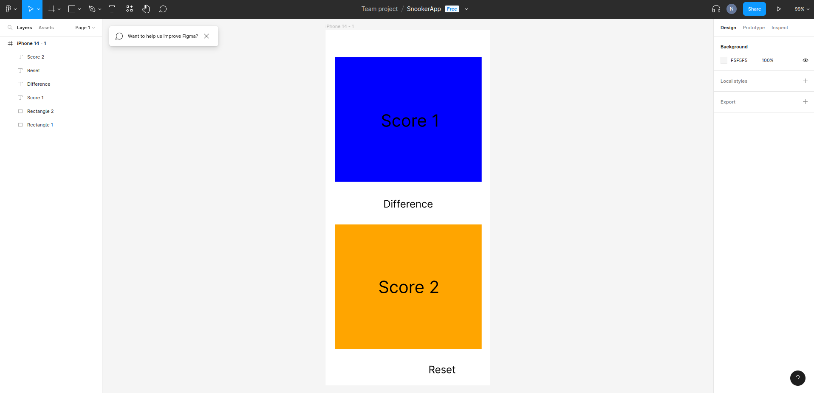
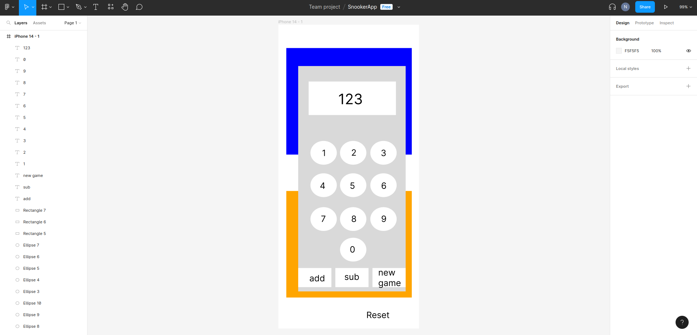
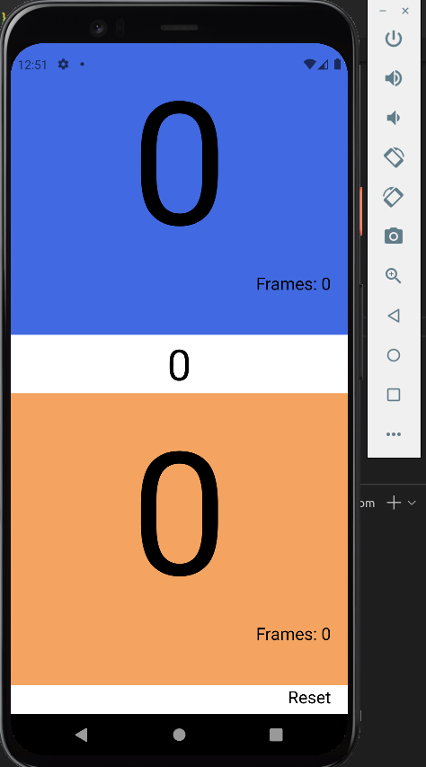
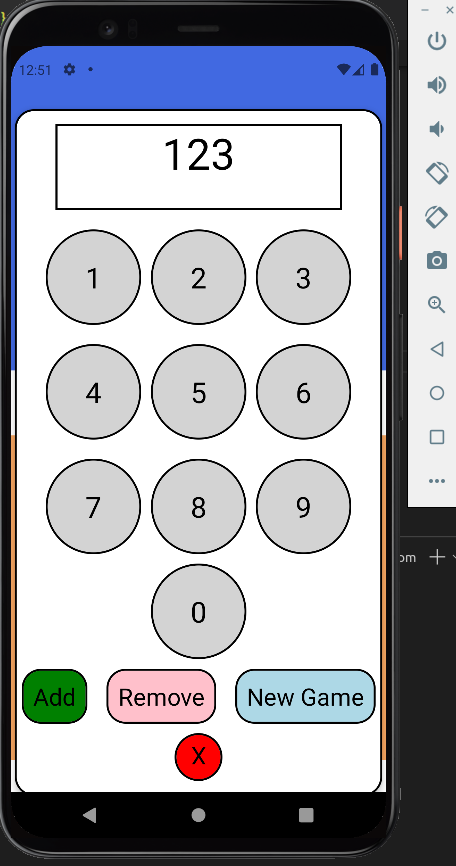

<h1>Snooker Scorer!</h1>

# A mobile application made with React Native where a user can track the score of two players during a snooker match.

I made this application because I was approached by a friend in need who was complaining about writing down using paper and pen and using mental arithmetic to keep track of and find the difference between the scores of the games of snooker he was playing. I did some research and found that there were no apps of the sort on the Play Store that were simple and easy to use. So, I took on the task of creating such an app.

I started by discussing what the app should look like, and I was given a design made on Figma that I should mirror. 

 
Figure 1 - Figma design that I was tasked with recreating in React Native. 

 
Figure 2 - Figma design of the popup "calculator" to add, subtract or end the frame. 

I first created a react-expo app, then went onto start the scores. I wanted to create two boxes that were clickable, with text in the middle. As I wanted to have more control over the look of the button and not have fixed settings, I used Pressable instead of Button. I created the pressables, which initially had no function, then added colour and text to them. 

During a project I completed as part of a group, I learned about Modals and how to use them. I made the pressables able to view the modal which contained the "calculator". The calculator was made from scratch, each number was a pressable that updated the calculators screen using the useState function. Finally, the buttons at the bottom of the calculator for add and subtract had their own functions, and the new game button compared the scores and added 1 to the frame score of the player. 

At this current stage, the app looks like this: 
  
Figure 3 - When the app launches you are greeting by the two scores inside of buttons. 

 
Figure 4 - This shows what happens when you click on a players score, you are able to input numbers and add or subtract. The new game button checks the difference between scores and adds 1 to the frames score on the first screen to whoever had the highest score. 
